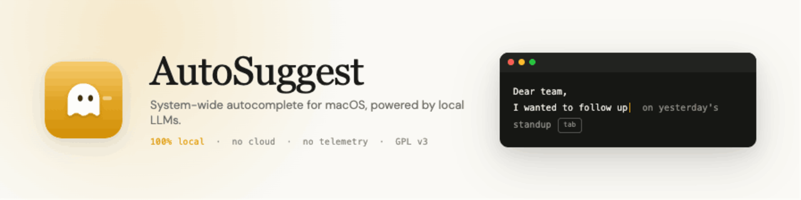

<p align="center">
  
</p>

<h1 align="center">AutoSuggest</h1>

<p align="center">
  System-wide inline autocomplete for macOS, powered by a language model that runs
  <strong>entirely on your Mac</strong>. No cloud, no account, no telemetry.
  <br>
  <a href="https://autosuggest.cloudx.run">Website</a> ·
  <a href="https://github.com/2002Bishwajeet/autosuggest/releases">Download</a> ·
  <a href="CHANGELOG.md">Changelog</a>
</p>

<p align="center">
  
  
  
</p>

---

AutoSuggest watches the text field you're typing in, asks a local model what comes
next, and shows the suggestion inline — press **Tab** to accept, **Esc** to dismiss.
It works in any app, and your keystrokes never leave the machine.

- **Private** — inference, context, and personalization stay on-device. No accounts, no analytics.
- **Fast** — 100–300 ms suggestions via Ollama, llama.cpp, or CoreML; tuned for Apple Silicon.
- **Yours to tune** — per-app exclusion rules, PII filtering, battery-aware pause, and opt-in personalization that learns your style.
- **Open** — GPL v3, written in Swift 6.2 with strict concurrency.

## Install

**Download (recommended).** Grab the latest signed & notarized build from the
[releases page](https://github.com/2002Bishwajeet/autosuggest/releases), drag
`AutoSuggest.app` to `/Applications`, and open it. Or one line:

```bash
curl -fsSL https://raw.githubusercontent.com/2002Bishwajeet/autosuggest/main/scripts/install.sh | bash
```

You also need a local model runtime — the quickest is Ollama:

```bash
brew install ollama && ollama serve
ollama pull qwen2.5:1.5b
```

## First run

1. Grant **Accessibility** and **Input Monitoring** when prompted
   (System Settings → Privacy & Security). Both are required for a system-wide
   autocomplete; nothing works without them.
2. Start typing in any text field. Suggestions appear inline — **Tab**/**Enter**
   to accept, **Esc** to dismiss.

AutoSuggest lives in the menu bar; click the ghost glyph to pause, switch models,
exclude an app, or open settings.

**Requirements:** macOS 13 (Ventura)+, Apple Silicon recommended (Intel works, slower).

## Runtimes

Pick any; the engine tries them in order and falls through automatically.

| Runtime | Setup |
|---|---|
| **Ollama** (recommended) | `brew install ollama` → `ollama pull qwen2.5:1.5b` |
| **llama.cpp** | `llama-server -m model.gguf --port 8080` |
| **CoreML** | On-device via the Apple Neural Engine — point Settings → Model Source at a CoreML manifest |

## Privacy

Everything runs locally. Accepted suggestions are never logged; optional telemetry
is off by default and content-free. Personalization is opt-in, PII-filtered,
encrypted at rest, and never transmitted. AutoSuggest stays silent in password
fields and macOS secure input. Read the
[privacy source](Sources/AutoSuggestApp/Privacy) — it's all auditable.

## Build from source

```bash
# Library + menu-bar runner (fast iteration)
swift build
swift run AutoSuggestRunner
swift test

# The real app target (correct for permission testing & distribution)
cd macos && xcodegen generate
open AutoSuggestDesktop.xcodeproj   # scheme: AutoSuggestDesktop, Cmd+R
```

Use the Xcode app target for anything permission-sensitive — it builds a real
bundled `AutoSuggest.app` with a stable bundle ID. See [`CLAUDE.md`](CLAUDE.md)
for the architecture map and conventions.

**Project layout**

| Path | What |
|---|---|
| `Sources/AutoSuggestApp/` | The library: input → context → policy → inference → overlay → insertion pipeline |
| `macos/` | xcodegen spec + the distributable Xcode app shell |
| `website/` | Marketing site (static, deployed to Cloudflare Pages) |
| `training/` | Fine-tuning scripts (MLX / Colab) — see [docs/FINE_TUNING.md](docs/FINE_TUNING.md) |
| `docs/` | [Architecture](docs/ARCHITECTURE.md), [local setup](docs/LOCAL_SETUP.md), fine-tuning |

Config lives at `~/Library/Application Support/AutoSuggestApp/config.json`
(runtime order, model source, exclusion rules); it's created on first run and
migrated forward across versions.

## Fine-tuning

Train a small model on your own writing — on-device with MLX, or free on a Colab
GPU — then import the GGUF with one command. See
[docs/FINE_TUNING.md](docs/FINE_TUNING.md).

## Contributing

Issues and PRs welcome. Run `swift test` and `swiftformat Sources Tests --lint`
before pushing; CI runs both. Touching the insertion, policy, or privacy paths?
Read the "Critical paths" section in [`CLAUDE.md`](CLAUDE.md) first.

## License

[GPL v3](LICENSE).
